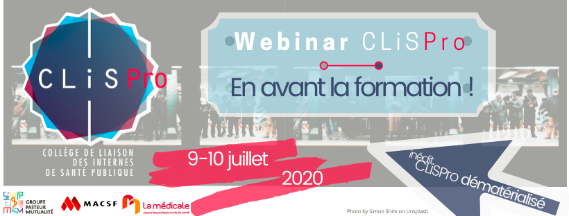

layout: true

<style>
.remark-slide-number {
  position: inherit;
}

.remark-slide-number .progress-bar-container {
  position: absolute;
  bottom: 0;
  height: 4px;
  display: block;
  left: 0;
  right: 0;
}

.remark-slide-number .progress-bar {
  height: 100%;
  background-color: red;
}
</style>

<div class="my-footer"><span> 
CAISP 2020 - Obvie Apps
&emsp;&emsp;&emsp;&emsp;&emsp;&emsp;&emsp;&emsp;&emsp;&emsp;&emsp;&emsp;
&emsp;&emsp;&emsp;&emsp;&emsp;&emsp;&emsp;&emsp;&emsp;&emsp;&emsp;
Raphaël Simon 
&emsp;&emsp;&emsp;&emsp;&emsp;&emsp;&emsp;&emsp;&emsp;&emsp;&emsp;&emsp;
&emsp;&emsp;&emsp;&emsp;&emsp;&emsp;&emsp;&emsp;&emsp;&emsp;&emsp;
rsimon-caisp2020@netlify.app </span></div>  
---
class: center, inverse
count: false
background-image: 
background-position: 50% 75%

# Obvie: de l'idée à l'application .font30[(*)]  
  
## .content-box-orange[Raphaël SIMON]  
### ISP Lyon | 8e semestre  
.footnotes[.font70[<i>* Ou comment transformer un tacos en projet</i>]]

???

Bonjour, je suis Raphaël Simon, interne lyonnais en 8e semestre et j'ai choisi de vous présenter un projet qui sort de l'ordinaire du CAISP puisqu'il ne s'agit pas d'un projet de recherche ou lié à un stage.
Je vais vous parler d'Obvie, une collaboration issue d'un tacos
---
```{r setup, include=FALSE}
options(htmltools.dir.version = FALSE)
knitr::opts_chunk$set(echo = FALSE)
```


```{r xaringan-themer, include=FALSE, warning=FALSE}
library(xaringanthemer)
style_mono_accent(
  base_color = "#232e3f",
  header_font_google = google_font("Roboto Condensed"),
  text_font_google   = google_font("Poppins", "400", "400i"),
  code_font_google   = google_font("Jet Jane Mono"),
  outfile = "index_files/xaringan-themer.css")
```

class: center, middle, inverse
count: false

# Introduction
---
<h2>.center[Tout démarre lors d'une pause déjeuner entre ISP]</h2>
--
background-image: url(https://thumbs.gfycat.com/SelfassuredForsakenAnt-small.gif)
background-size: 50%
background-position: center middle
--
background-image: 

* 25 Juillet 2019: les résultats des ECNi2019 occupent la discussion.
--
name: beforeiframe
* Rapidement, la conversation s'oriente vers le portail Celine du CNG, et les douleureux souvenirs de parcourir ces tableaux blancs et violets.  
--
<iframe src="https://www.cng.sante.fr/sites/default/files/rangslimites2019.html" width = 1000 height = 300 ></iframe>  
---
template: beforeiframe
<br><br>
&rarr; Deux enjeux rapidement repérés:
--
background-image: url(https://i.imgflip.com/1mbcm8.jpg)
background-size: 20%
background-position: 20% 75%
.content-box-orange[.white[Lisibilité]]
--
background-image: url(https://i.imgflip.com/1mbcm8.jpg), url(https://media.giphy.com/media/XdORe0Wi4E1CuXP2Nm/giphy.gif)
background-size: 20%, 30%
background-position: 20% 75%, 70% 75%
et .content-box-orange[.white[Interprétation]]

???

Fin juillet 2019, 6 ou 7 ISP lyonnais sont assis en terrasse pour déjeuner. Au menu: tacos!  
Et au menu de la conversation, les résultats de l'ECN 2019. 
---

## .center[Les questions qu'on se pose]
--

* Quelles sont les spé les plus populaires? Et les villes?
--

* Combien de gens n'ont pas encore fait de voeu?
--

* Combien de places de Santé Publique reste-t-il en France ?!
--

* Est-ce qu'il y a vraiment des gens qui font des "faux voeux" pour garder la place aux copains?  
--
background-image: 
<br><br><br><br>
.center[.font140[.content-box-orange[.white[Comment faire mieux avec ces données?]]]] 

???

Ce qu'on pourrait qualifier de nos "questions de recherche" sont les suivantes
---
class: center, inverse, middle
background-image: url(https://images.unsplash.com/photo-1485848395967-65dff62dc35b?ixlib=rb-1.2.1&ixid=eyJhcHBfaWQiOjEyMDd9&auto=format&fit=crop&w=1349&q=80)
background-size: cover

# Ambiance "mois d'Août" en stage
---
class: inverse, center
## .center[Objectif]

<br><br><br><br>
.font150[.content-box-orange[.white[Créer une application en libre accès permettant aux étudiants une meilleure expérience des choix post-ECNi]]]  
--
background-image: url(https://media.giphy.com/media/PiQejEf31116URju4V/giphy.gif)
background-position: 50% 95%
background-size: 40%
<br><br><br><br>
.right[... En 3 semaines]
---
class: center, middle, inverse

# Méthodes
---
background-image: url(https://images.unsplash.com/photo-1564767655658-4e6b365884ff?ixlib=rb-1.2.1&ixid=eyJhcHBfaWQiOjEyMDd9&auto=format&fit=crop&w=1350&q=80)
background-size: cover
--
background-image: 
class: center, middle

# .corporate-red[PROTEINES] .green[VITAMINES]
# .light-digi-gold[TORTILLA] .mauve-blue[SALSA] 
---
class: center, middle

# .corporate-red[DONNÉES] .green[APPLICATION]
# .light-digi-gold[HEBERGEMENT] .mauve-blue[COMMUNICATION] 
---
class: center, middle, inverse
background-image: url(https://images.unsplash.com/photo-1558030006-450675393462?ixlib=rb-1.2.1&ixid=eyJhcHBfaWQiOjEyMDd9&auto=format&fit=crop&w=1489&q=80)
background-size: cover

<br><br><br><br><br><br>
# Protéines = Résultats ECNi2019
---

## .center[Résultats ECNi2019] 
.font130[Les données utilisées:]
--

* Tableau dynamique de pré-choix/choix
--

* Tableau du nombre de postes ouverts par ville/spé 
--

* Listing des étudiants, leurs classements et CESP/ESSA

???

Tableau dynamique a recup tous les jours mini via celine
Nb de postes celine + JO (peut changer!)
Listing par le JO
---
class: center, inverse, right
background-image: url(https://images.unsplash.com/photo-1518843875459-f738682238a6?ixlib=rb-1.2.1&ixid=eyJhcHBfaWQiOjEyMDd9&auto=format&fit=crop&w=1326&q=80)
background-size: cover

# Vitamines = RShiny
---

## .center[RShiny]  
.font130[Combinaison de 4 langages:]  
--
background-image: url(https://duckduckgo.com/i/e903addb.png)

* .font110[R]
--
background-image: url(https://i.stack.imgur.com/Mmww2.png)
* .font110[JavaScript]
--
background-image: url(https://www.logolynx.com/images/logolynx/s_cf/cf9600eac22a4dde77bf1a3c7cdae936.png)
* .font110[HTML et CSS]  
--
background-image:

<br><br>
.white[.content-box-orange[.font120[&rarr; Permet de construire des applications web en utilisant R pour les calculs et le traitement des données côté serveur]]]
---
class: center, inverse, bottom
background-image: url(https://images.unsplash.com/photo-1591266123515-46149ea0b0a9?ixlib=rb-1.2.1&ixid=eyJhcHBfaWQiOjEyMDd9&auto=format&fit=crop&w=1350&q=80)
background-size: cover

# Tortilla = Shinyapps.io
---
background-image: url(index_files/adds/shinyapps.png)
background-size: contain
## .center[Shinyapps.io]  
--
background-image: 

* .font110[Solution d'hébergement parmi d'autres comme: ]
--

  - Amazon AWS  
  - Google Cloud  
  - DigitalOcean  
  - Heroku  
  - Serveur autohébergé  
--

* .font110[Avantages:]  
  * Extrêmement facile d'utilisation  
  * Coût moindre (au début)  
  * Développé par les dev de Shiny  
--

* .font110[Inconvénients:]  
  * Peu de contrôle sur le comportement du serveur  
  * Pas de stockage interne de données (à l'époque)  
  * Cher si forte fréquentation

---
class: right, inverse, bottom
background-image: url(https://images.unsplash.com/photo-1517646458010-ea6bd9f4a75f?ixlib=rb-1.2.1&ixid=eyJhcHBfaWQiOjEyMDd9&auto=format&fit=crop&w=1350&q=80)
background-size: cover

# Salsa = Réseaux sociaux
---
background-image: url(index_files/adds/facebook.png)
background-size: 65%
background-position: 50% 99%

## .center[Réseaux sociaux]
--
background-image: url(index_files/adds/twitter.png)
background-size: 70%
background-position: 50% 50%
--
background-image: url(index_files/adds/fbrev.png)
background-size: 50%
background-position: 50% 50%

.footnote[Commenté par le dev de CELINE ...]
--
background-image: url(index_files/adds/fbrev.png), url(https://media.giphy.com/media/DFNd1yVyRjmF2/giphy.gif)
background-size: 50%, 30%
background-position: 20% 50%, 90%, 90%
---
background-image: url(index_files/adds/wudoc.png)
background-size: contain
class: inverse

# .content-box-orange[Presse]
---
class: center, middle, inverse

# Resultats
---
<iframe src="https://rsapps.shinyapps.io/celineapp" width="100%" height="100%" ></iframe>  

???

Je suis un D4 post ECN, j'arrive sur la page d'accueil et déjà je peux voir des informations génerales sur mon ECNi.

Mais ce qui m'interesse le plus c'est l'onglet personalisé. Je peux dire que je suis 2020e, et observer les postes et/ou villes qui me restent. (faire demo)

On a vu un usage constant de l'app durant 1 mois et demi. Depuis, on a moins de fréquentation mais elle n'a pas disparu!
---
class: center, middle, inverse

# Conclusion
---

# L'internat de santé publique c'est: 
--

* .font120[L'occasion d'acquérir des compétences hors de la médecine et de les mettre en pratique au service de bonnes causes]
--

* .font120[Des opportunités à foison de collaborer avec vos co-internes et cimenter votre futur réseau]
--

* .font120[La porte ouverte à l'entrepreneuriat et/ou la constitution d'un portfolio de vos projets]  
--

<br>
.center[.font140[.content-box-orange[.white[Des tacos qui sont plus que des tacos]]]]
--
background-image: url(https://media1.tenor.com/images/6fd0e9e0f057f07d9356e1d6d2355160/tenor.gif?itemid=16262619)
background-size: 50%
background-position: 50% 95%
---
background-image: url(https://media.giphy.com/media/DAtJCG1t3im1G/giphy.gif)
background-size: cover
class: top, center, inverse

# Merci de votre attention 
<br><br><br><br><br><br><br><br>
# Des questions ou des idées d'amélioration?
.shadow[Contact:  @RplSmn |  raphael.simon.contact@gmail.com]

???

C'est tout, merci de m'avoir écouté et merci au CliSP de m'avoir laissé présenter mes projets ces deux dernières années.
Au delá des questions, si vous avez des suggestions on est preneurs bien entendu!
---

# .center[Sources]  

- Classements ECNi2019: [Legifrance](https://www.legifrance.gouv.fr/affichTexte.do?cidTexte=JORFTEXT000038783224&dateTexte=&categorieLien=id)  
- Listing: [CNG Celine](https://www.cngsante.fr/chiron/celine/listing.html)
- R: https://www.r-project.org/
- RShiny: https://shiny.rstudio.com/  
- R 📦 utilisés dans l'app:  
  * shinydashboard & shinydashboardPlus
  * shinyWidgets
  * ggplot2  
  * dplyr  
  * stringr
  * plotly  
  * rvest  
  * httr  
- Slides avec le 📦 {xaringan}  

---
